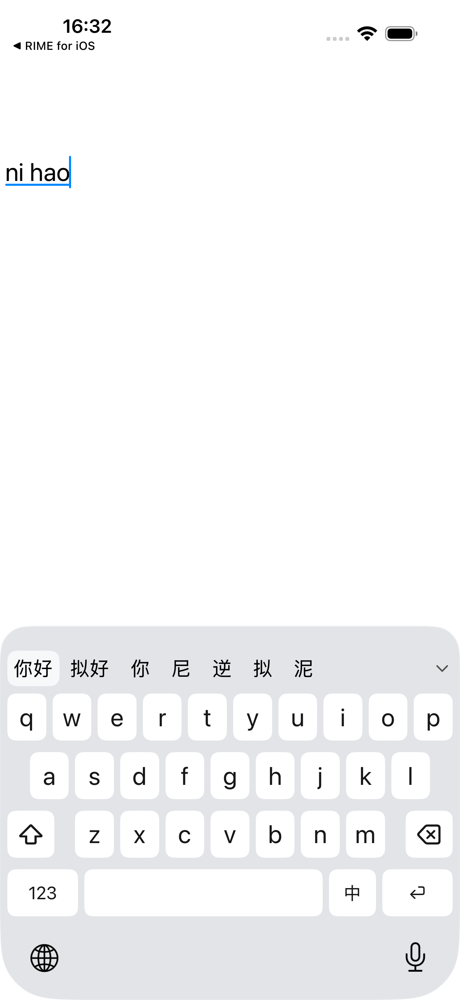
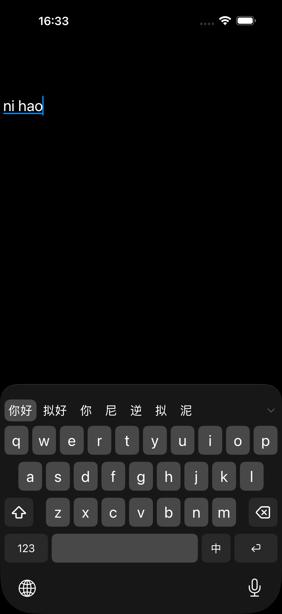

  

# RIME for iOS

一款极简的 iOS 拼音输入法，基于 RIME 引擎。

## 特性

- **全拼输入**：朙月拼音方案，支持中英混输
- **多设备同步**：通过 WebDAV 同步用户词库与自定义短语
- **深浅色跟随**：外观自动适配宿主应用深浅色模式

## 截图

  
  

## 安装

1. 从 [Releases](../../releases) 下载最新未签名 ipa 后通过 AltStore、Feather 等工具自签后安装；
2. 打开「设置 → 通用 → 键盘 → 键盘」→「添加新键盘…」→ 选择 **RIME for iOS**；
3. 点按 RIME for iOS → 开启「允许完全访问」（同步功能必需）。

## 同步设置

调出键盘，点候选栏左侧菜单按钮进入「同步」页；点字段后用键盘编辑：

1. **服务器地址 / 用户名 / 密码**：你的 WebDAV 服务（如 Koofr、坚果云）账号，仅支持 HTTPS；
2. 点「保存」，连接测试通过后凭据写入受 iOS 数据保护的配置文件；
3. 点「同步」按钮开始同步，结果在键盘顶部提示。

新标识符会创建独立安装。升级前先在旧键盘同步词库；安装后重新启用键盘、填写配置并同步恢复。

多台设备使用不同「安装 ID」即可互相同步词库（默认 `iPhone`，每台设备应设为不同名称）。

## 隐私

- 词库学习完全在本机进行，不上传任何按键内容；
- 同步仅在你主动触发时进行，且只传输用户词库与自定义短语；
- 凭据保存在受 iOS 数据保护、排除备份的配置文件中。

## 许可

源代码以 [MIT](LICENSE) 许可发布；内置的 librime 及 RIME 数据遵循其各自的开源许可，详见 [THIRD-PARTY-NOTICES.md](THIRD-PARTY-NOTICES.md)。
